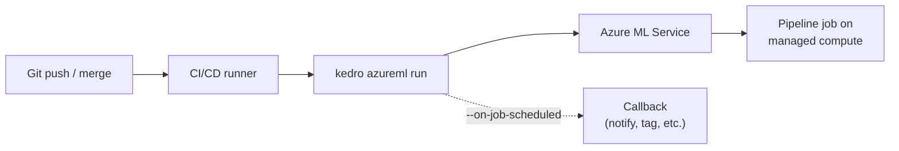

# How to Deploy Pipelines from CI/CD

This guide shows how to submit Azure ML pipeline jobs from a CI/CD system using service principal authentication and the plugin CLI.



## Prerequisites

- The Kedro AzureML Pipeline plugin installed and configured (see [Getting Started](../tutorials/getting-started.md))
- An Azure [service principal](https://learn.microsoft.com/en-us/azure/active-directory/develop/app-objects-and-service-principals) with the `Contributor` or `AzureML Data Scientist` role on your workspace
- CI/CD runner with Python 3.11+ and `az login` or environment variable authentication

## Configure service principal authentication

The plugin uses `DefaultAzureCredential` from the Azure Identity SDK. For CI/CD, set these environment variables in your CI/CD secrets:

```bash
AZURE_TENANT_ID="<your-tenant-id>"
AZURE_CLIENT_ID="<your-client-id>"
AZURE_CLIENT_SECRET="<your-client-secret>"
```

See [How to authenticate](authenticate.md) for service principal creation, role assignments, and troubleshooting.

## GitHub Actions example

```yaml
name: Deploy pipeline
on:
  push:
    branches: [main]

jobs:
  deploy:
    runs-on: ubuntu-latest
    env:
      AZURE_TENANT_ID: ${{ secrets.AZURE_TENANT_ID }}
      AZURE_CLIENT_ID: ${{ secrets.AZURE_CLIENT_ID }}
      AZURE_CLIENT_SECRET: ${{ secrets.AZURE_CLIENT_SECRET }}

    steps:
      - uses: actions/checkout@v4

      - uses: astral-sh/setup-uv@v5

      - run: uv sync --no-dev

      - name: Submit pipeline
        run: uv run kedro azureml run -j training --wait-for-completion
```

## Use a callback for notifications

The `--on-job-scheduled` flag accepts a `module:function` reference that is called after each job is submitted. Use this to send notifications or trigger downstream workflows:

```python
# myproject/callbacks.py
def notify_slack(job_info):
    """Called after the Azure ML job is submitted."""
    # job_info contains the job object returned by Azure ML
    print(f"Job submitted: {job_info.studio_url}")
```

```bash
kedro azureml run -j training --on-job-scheduled myproject.callbacks:notify_slack
```

## Submit multiple jobs

Pass `-j` multiple times to submit several jobs in one invocation:

```bash
kedro azureml run -j training -j validation --wait-for-completion
```

## Override workspace per environment

Use the `-w` flag or Kedro environments to target different workspaces:

```bash
# Using -w flag
kedro azureml run -j training -w prod

# Using Kedro environment with a separate conf/prod/azureml.yml
kedro azureml run -j training --env prod
```

## See also

- [Configuration reference](../reference/configuration.md#workspace) for workspace definitions
- [CLI reference](../reference/cli.md#kedro-azureml-run) for all `run` flags
- [How to configure multiple workspaces](configure-multiple-workspaces.md) for workspace management
